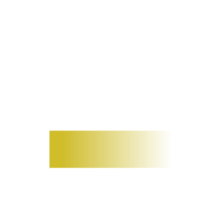

# European Galaxy Branding Resources

## Galaxy Europe

- Use this anywhere we're really talking about the european galaxy project as a collective.
- Do not use this when referring to specific sub-teams fo the Galaxy Project Europe.
- E.g. posters next to your ELIXIR/deNBI logos

Light Background                           | Dark Background
----------------------------------------   | ----
         | 
[PNG (Large)](galaxy-eu/galaxy-eu.png)     | [PNG (Large)](galaxy-eu.inv/galaxy-eu.inv.png)
[PNG 1024px](galaxy-eu/galaxy-eu.1024.png) | [PNG 1024px](galaxy-eu.inv/galaxy-eu.inv.1024.png)
[PNG 512px](galaxy-eu/galaxy-eu.512.png)   | [PNG 512px](galaxy-eu.inv/galaxy-eu.inv.512.png)
[PNG 256px](galaxy-eu/galaxy-eu.256.png)   | [PNG 256px](galaxy-eu.inv/galaxy-eu.inv.256.png)
[PNG 128px](galaxy-eu/galaxy-eu.128.png)   | [PNG 128px](galaxy-eu.inv/galaxy-eu.inv.128.png)
[SVG](./galaxy-eu.svg)                     | [SVG](galaxy-eu.inv.svg)

## useGalaxy.eu

- Use this anywhere where you want to direct users to our server, e.g.
  trainings where you want to remind users "here is the URL" and stickers you
  place which should be able to point users to our server with no further
  text.

Light Background                                 | Dark Background
----------------------------------------         | ----
         | 
[PNG (Large)](useGalaxy.eu/useGalaxy.eu.png)     | [PNG (Large)](useGalaxy.eu.inv/useGalaxy.eu.inv.png)
[PNG 1024px](useGalaxy.eu/useGalaxy.eu.1024.png) | [PNG 1024px](useGalaxy.eu.inv/useGalaxy.eu.inv.1024.png)
[PNG 512px](useGalaxy.eu/useGalaxy.eu.512.png)   | [PNG 512px](useGalaxy.eu.inv/useGalaxy.eu.inv.512.png)
[PNG 256px](useGalaxy.eu/useGalaxy.eu.256.png)   | [PNG 256px](useGalaxy.eu.inv/useGalaxy.eu.inv.256.png)
[PNG 128px](useGalaxy.eu/useGalaxy.eu.128.png)   | [PNG 128px](useGalaxy.eu.inv/useGalaxy.eu.inv.128.png)
[SVG](./useGalaxy.eu.svg)                        | [SVG](useGalaxy.eu.inv.svg)

## Logo

- Anywhere a logo is needed in our colours, without any text.
- E.g. favicons / etc.

Light Background                                     | Dark Background
----------------------------------------             | ----
         | 
[PNG (Large)](galaxy-eu-logo/galaxy-eu-logo.png)     | [PNG (Large)](galaxy-eu-logo.inv/galaxy-eu-logo.inv.png)
[PNG 1024px](galaxy-eu-logo/galaxy-eu-logo.1024.png) | [PNG 1024px](galaxy-eu-logo.inv/galaxy-eu-logo.inv.1024.png)
[PNG 512px](galaxy-eu-logo/galaxy-eu-logo.512.png)   | [PNG 512px](galaxy-eu-logo.inv/galaxy-eu-logo.inv.512.png)
[PNG 256px](galaxy-eu-logo/galaxy-eu-logo.256.png)   | [PNG 256px](galaxy-eu-logo.inv/galaxy-eu-logo.inv.256.png)
[PNG 128px](galaxy-eu-logo/galaxy-eu-logo.128.png)   | [PNG 128px](galaxy-eu-logo.inv/galaxy-eu-logo.inv.128.png)
[SVG](./galaxy-eu-logo.svg)                          | [SVG](galaxy-eu-logo.inv.svg)
