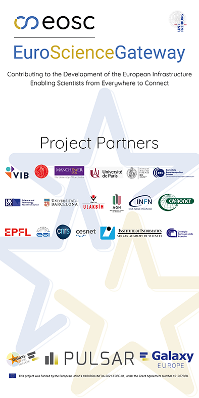

# ESG Rollup Banner

(This is a preview image not meant for print)

You can download the print files for the roll-up here: [Print PDF](./ESG_Rollup_print.pdf)

This is a print-ready PDF made specifically for the printer specifications of [Digitaldruck Fabrik](https://www.digitaldruck-fabrik.de/).
It will likely not be compatible with your local print-shop and you will need to adjust it.

The PDF uses the following specification:

* 1m x 2m Printing area
* 150 DPI
* Color Profile: ISO Coated v2 (not embedded)
* 2mm unmarked bleed
* 20cm glueing surface at the bottom (crop this away if you do not require a glueing surface)
