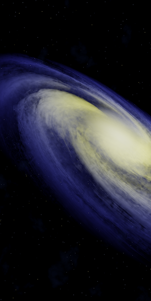
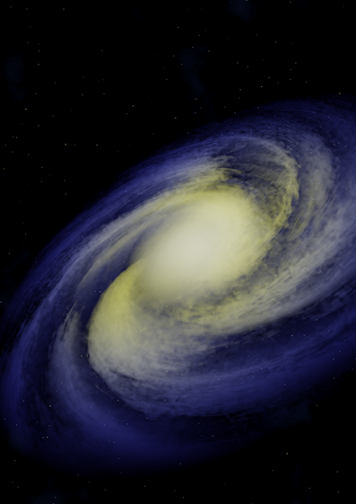
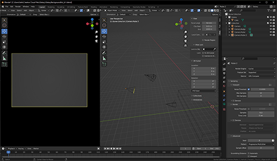
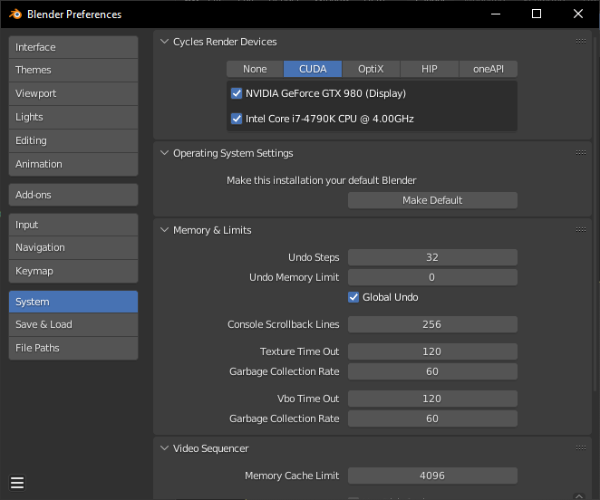
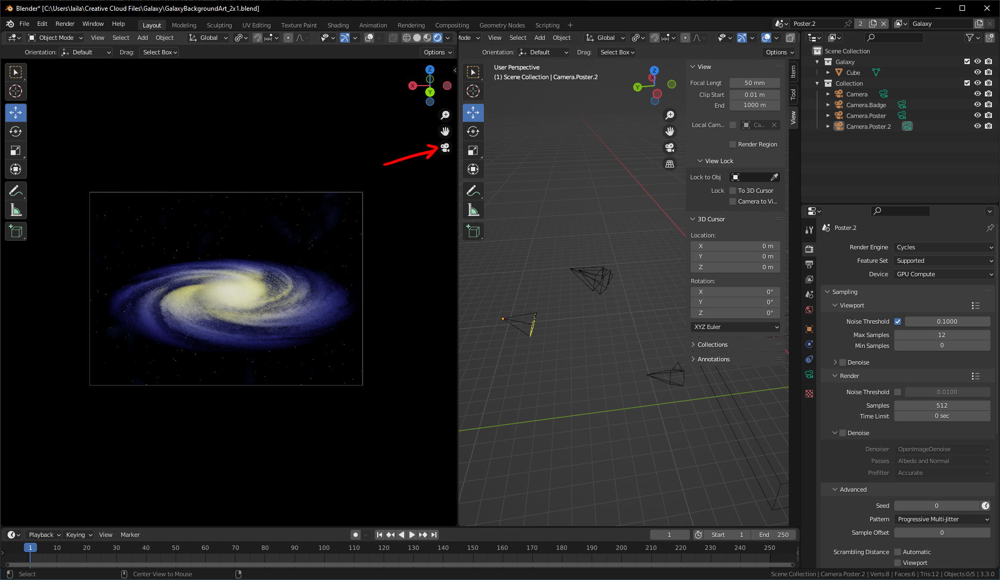
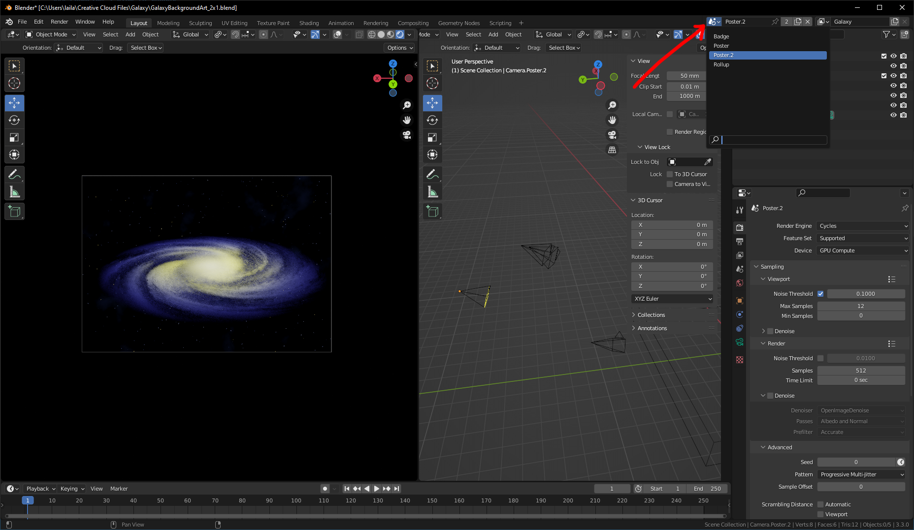
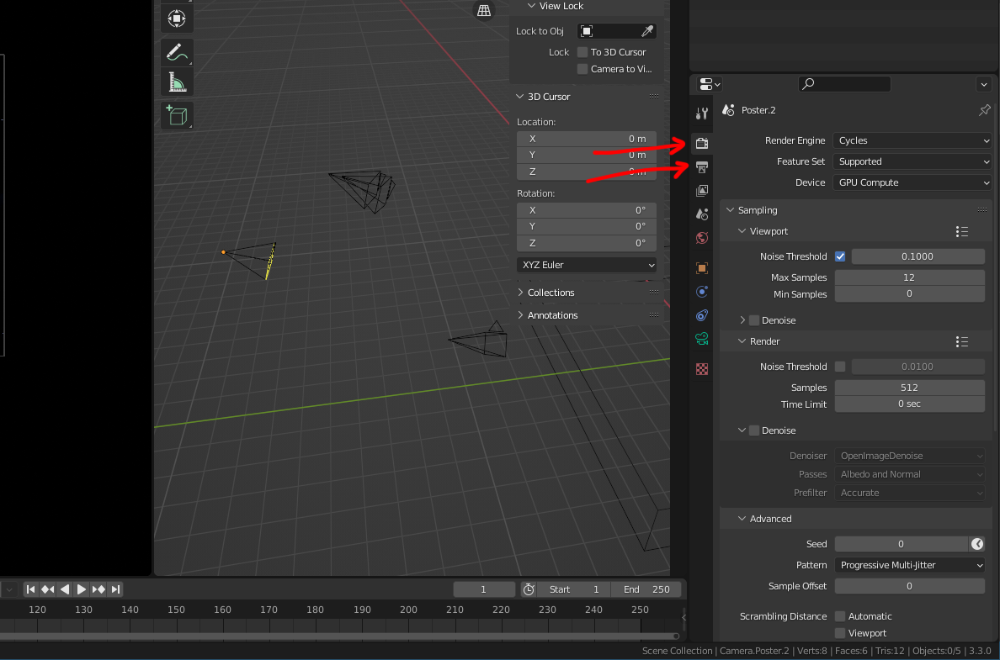
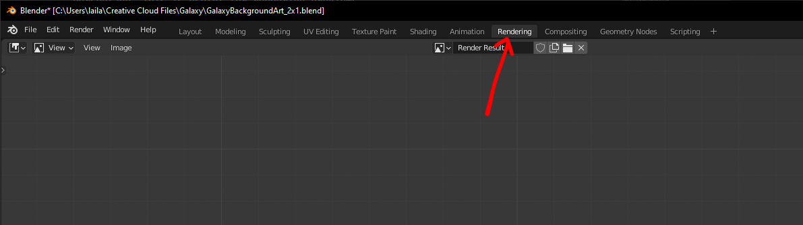
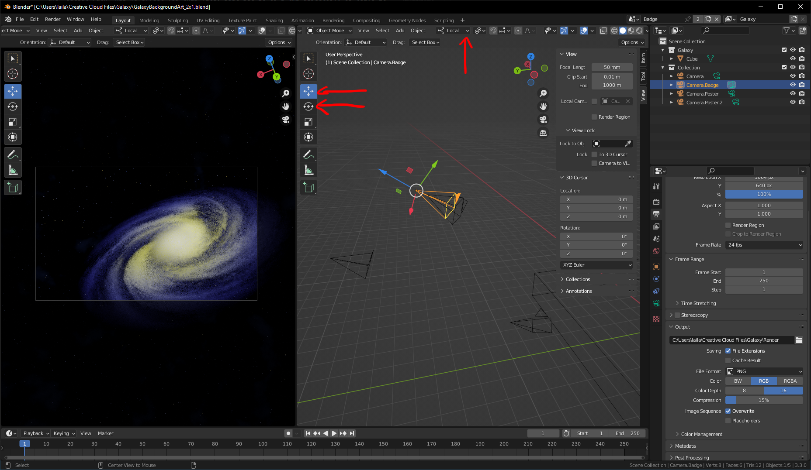
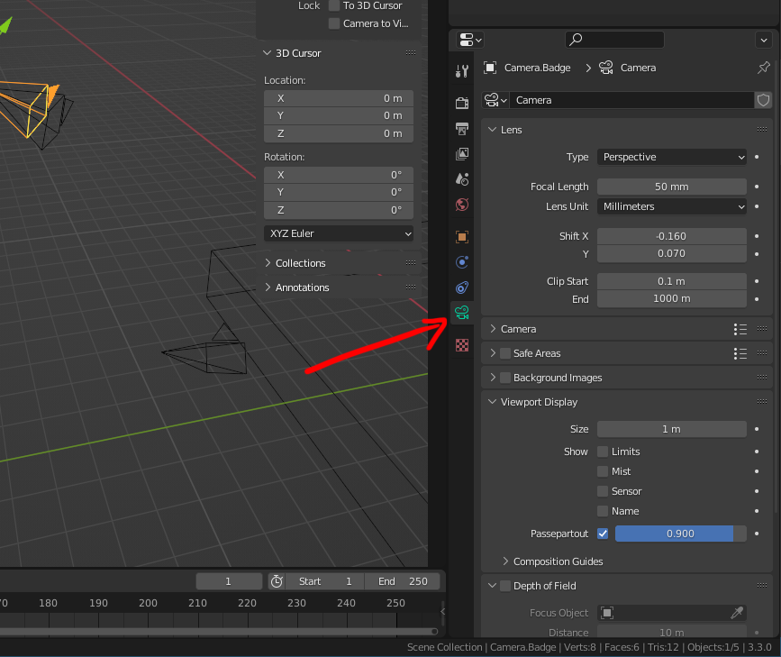

# Galaxy Render

You may have seen the new Galaxy roll-up with a galaxy in the Galaxy Projects colors as a background.

[download the rollup banner here](./banner.md)

This galaxy is a 3D render.
To use it in new promotional material, you can either download one of the pre-rendered high resolution images,
or render your own. The big advantage when rendering your own, is that you can render is from any angle, in any resolution or aspect ratio you require.

## Pre-Rendered Images

The images are rendered in 16-bit png to preserver color quality when transforming the file to other color formats (e.g. cmyk).
This can make them appear dark in some software.
If they do, add a simple exposure, curve, or gamma filter to them to correct the brightness.

I also recommend boosting the brightness when printing these images with consumer or office printers, as they often struggle with dark colors.

Download them here:

Rollup Banner | Poster Horizontal | Poster Vertical
--- | --- | ---
 |  | 
[Download Rollup Image](https://usegalaxy.eu/static/share/Render_202209221255.png) | [Download Poster Horizontal Image](https://usegalaxy.eu/static/share/RenderPosterHorizontal.png) | [Download Poster Vertical Image](https://usegalaxy.eu/static/share/RenderPosterVertical.png)

## Render your own

The galaxy is modeled in Blender 3.3.1 LTS. In order to make your own render, you will first have to [download and install blender](https://www.blender.org/download/). Newer versions of blender *might* work, but there are no guarantees they will.

Next, download the Project file from [here](https://usegalaxy.eu/static/share/GalaxyBackgroundArt_2x1.blend).

Once the download is complete, open the file in Blender.
It should look something like this:

We will first have to adjust some settings to ensure Blender makes the most of your computer hardware.

1. click "Edit" in the upper left corner of Blender
2. click "Preferences..."
3. Open "System" from the selection on the left
4. Under the first option "Cycles Render Devices" select one that isn't none.
	* If you have a Nvidia GPU, select "OptiX" (newer GPUs) or "CUDA" (Old GPUs)
	* If you have an AMD GPU, select "HIP", or on Mac, select "Metal"
	* If you have an Intel Arc GPU, select "oneAPI"
	* If you do not have a GPU, beware that the rendering will be very slow
	
	I recommend checking the checkboxes for all devices listed under your selected option. This will tell Blender to use more than one device while rendering, and speed up rendering. If you however have a very weak CPU, you might only want to check your GPU.
5. Close the Preferences

Here are my settings as an example:

Now we are ready to review the galaxy. In the left viewport, in the upper right corner, there are four sphere icons. You may need to scroll the viewport top-bar for them to show up, or make the viewport larger. Press the fourth sphere "Display Render Preview"

If you are using Blender for the first time, this may take a while, because Blender may need to install some drivers in the background. Blender has likely not crashed, even if it is frozen. Give it some time.

You should now see the galaxy from the current cameras Perspective in the left viewport.
If you have accidentally moved the viewport away from the camera (there is no longer a box in the center of the view), you can restore it by pressing on the camera icon in the viewport "Toggle camera View"

### Choosing a View to Render

In the upper right corner of blender there is a scene selector, where you can switch between different cameras and resolutions. There are four presets. Press the scene selector, and switch to the desired scene.

### Changing Render Settings

In the lower right Panel (the properties Panel), there are many options available, sorted under tabs. Currently we only care about the second and third tab "Render Properties" and "Output Properties"

In "Render Properties" we can adjust the quality of the render, which also affects how long it takes to render.

Under "Render" there is an option named "Samples". This indicates how many times each pixel is sampled. I would recommend to use at least 256, ideally 512. If this takes too long, you can go even lower (~64) and activate "Denoise". This is also a good option if you just need to render a preview.

In "Output Properties" we can set the resolution, and file type. Enter your desired Resolution under "Format" -> "Resolution". The % option will decrease your resolution by a percentage. This is useful for rendering previews.

Under "Output" you can set the file format. I would recommend leaving this at PNG. Setting the "Output Path" has no effect for this file. Just set it to a tmp directory, or leave it as default. We will save the render in another dialog once it is done.

### Rendering

Finally, render your image by pressing "Render" in Blenders top bar, and then "Render Image".
A new window will appear showing you the renders progress. This will take a while. Once the render is done, you can save it by pressing "Image" -> "Save".

If you accidentally close this window before saving, do not worry. You can also save your render result under the "Rendering" Tab.

### Using a Custom View

First, read up on how to navigate the Blender viewport in the [Blender Documentation](https://docs.blender.org/manual/en/latest/editors/3dview/navigate/introduction.html).

Select a scene you want to modify, and select it's camera. Tip: The current scenes active camera is highlighted in yellow.

You can move the camera around using the move and rotate tools.

You can switch between local and global coordinates with the dropdown in the viewports top-bar.

In the Properties panel press the green camera with the camera selected. Here you can change the cameras focal length, and shift it's sensor, under "Lens"

In the same panel, you can also press the orange box ("Object Properties") where you can position the camera in absolute units, under "Transform".

Once you are happy with the camera, render as explained above.
